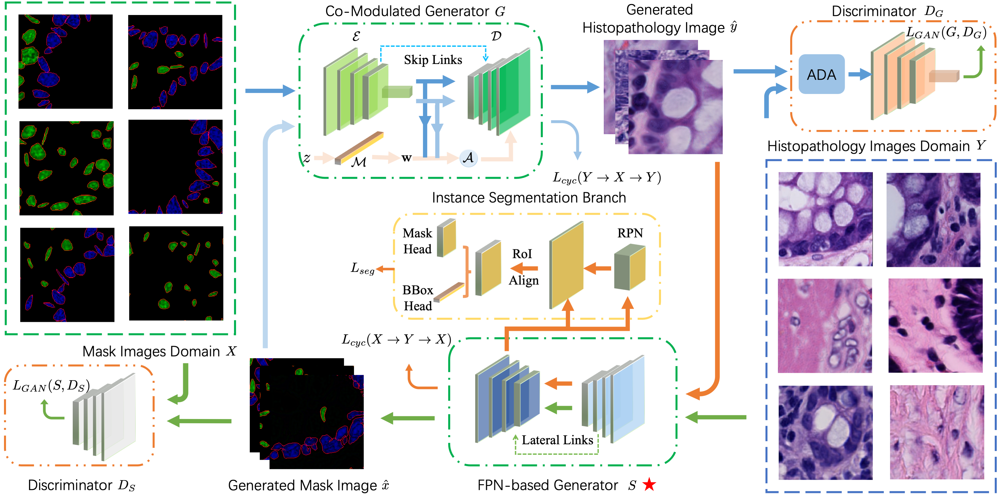

This repository contains codes and checkpoints for our [[TMI'23]](https://ieeexplore.ieee.org/document/10234386) paper "Nucleus-aware Self-supervised Pretraining Using Unpaired Image-to-image Translation for Histopathology Image"

by Zhiyun Song , Penghui Du , Junpeng Yan , Kailu Li , Jianzhong Shou , Maode Lai , Yubo Fan , Yan Xu

<div align="center">
  
</div>

Abstract: Self-supervised pretraining attempts to enhance model performance by obtaining effective features from unlabeled data, and has demonstrated its effectiveness in the field of histopathology images. Despite its success, few works concentrate on the extraction of nucleus-level information, which is essential for pathologic analysis. In this work, we propose a novel nucleus-aware self-supervised pretraining framework for histopathology images. The framework aims to capture the nuclear morphology and distribution information through unpaired image-to-image translation between histopathology images and pseudo mask images. The generation process is modulated by both conditional and stochastic style representations, ensuring the reality and diversity of the generated histopathology images for pretraining. Further, an instance segmentation guided strategy is employed to capture instance-level information. The experiments on 7 datasets show that the proposed pretraining method outperforms supervised ones on Kather classification, multiple instance learning, and 5 dense-prediction tasks with the transfer learning protocol, and yields superior results than other self-supervised approaches on 8 semi-supervised tasks. 

## Release notes

This repository depends on [StyleGAN2-ADA-PyTorch](https://github.com/NVlabs/stylegan2-ada-pytorch), and [Detectron2](https://github.com/facebookresearch/detectron2) for simultaneously generating and segmenting nucleus in pathology images.

## Requirements

* We recommend Linux for performance and compatibility reasons.
* 1&ndash;8 high-end NVIDIA GPUs with at least 12 GB of memory.
* CUDA toolkit 10.2 or later.  Use at least version 11.1 if running on RTX 3090.  (Why is a separate CUDA toolkit installation required?  See comments in [#2](https://github.com/NVlabs/stylegan2-ada-pytorch/issues/2#issuecomment-779457121).)
* 64-bit Python 3.7 and PyTorch 1.8.0. See [https://pytorch.org/](https://pytorch.org/) for PyTorch install instructions. One way to install Pytorch 1.8.0, which has been verify by the author, is:
`conda install pytorch==1.8.0 torchvision==0.9.0 torchaudio==0.8.0 cudatoolkit=10.2 -c pytorch`
*  StyleGAN2-ADA-PyTorch dependencies: `pip install click requests tqdm pyspng ninja psutil scipy shapely opencv-python imageio-ffmpeg==0.4.3` according to [StyleGAN2-ADA-PyTorch](https://github.com/NVlabs/stylegan2-ada-pytorch) and our requirements. 
*  Detectron2 dependencies: you need to first `cd ../` and `python -m pip install -e UNITPathSSL` according to [Detectron2_installation](https://detectron2.readthedocs.io/en/latest/tutorials/install.html).

## Preparing datasets

All of the datasets for training should be placed under `CYCLE.DATASET_ROOT` defined in config-file. The whole structure need to like this:
| Path | Description
| :--- | :----------
| CYCLE.DATASET_ROOT | Main directory of datasets
| &ensp;&ensp;&boxur;&nbsp; CYCLE.DATASET_A_NAME | Generated mask data root directory
| &ensp;&ensp;&ensp;&ensp;&boxvr;&nbsp; cell_mask | Instance segmentation ground truth(`.npy` format) of generated mask data
| &ensp;&ensp;&ensp;&ensp;&boxur;&nbsp; CYCLE.DATASET_A_SCALE | Specified scale of generated mask data(`.png` format)
| &ensp;&ensp;&boxur;&nbsp; CYCLE.DATASET_B_NAME | Real pathology
| &ensp;&ensp;&ensp;&ensp;&boxur;&nbsp; CYCLE.DATASET_B_SCALE | Specified scale of real pathology(`.png` format)

Datasets for testing segmentation performance should be prepared according to [Detectron2-Use Builtin Datasets](https://detectron2.readthedocs.io/en/latest/tutorials/builtin_datasets.html) or [Use Custom Datasets](https://detectron2.readthedocs.io/en/latest/tutorials/datasets.html). 
For our setting, we recommend registering a COCO Format Dataset, which means adjusting `gt_json_file` and `gt_path` in `train.py` to your path of groung truth.

## Getting started
For nucleus mask generation, you can follow our settings with
```
Comming Soon
```
Pre-trained networks are stored as `*.pkl` files that can be referenced using local filenames or URLs.
If training from scratch, just remove MODEL.WEIGHTS.
```
Comming Soon
```
Outputs from the above command will be placed under `./output/` by default, you can also changed the path by adding `OUTPUT_DIR /directory/to/your/desired/output/path` to the end of your command.

## Pretrained Checkpoint

We provide ckpt used in the transfer learning experiments in our paper via Google Drive. Please download the checkpoint from the url:
[https://drive.google.com/drive/folders/1Pg2YRjyIxCPBsL7VVFZIaiVCB0iWKLJq?usp=sharing](https://drive.google.com/drive/folders/1ks0SqG8hNcN5rsrLQfwLt1jqBh0JIu1O?usp=sharing)

Then, you can reproduce the results in our paper. For example, you can train the Panoptic FPN on the Kumar dataset with:
```
python tools/train_net.py --config-file ./configs/ours/seg/kumar/proposed_panoptic.yaml 
```

## Citation

```
@article{Song_2023,
  doi = {10.1109/tmi.2023.3309971},
  url = {https://doi.org/10.1109%2Ftmi.2023.3309971},
  year = {2023},
  publisher = {Institute of Electrical and Electronics Engineers ({IEEE})},
  pages = {1--1},
  author = {Zhiyun Song and Penghui Du and Junpeng Yan and Kailu Li and Jianzhong Shou and Maode Lai and Yubo Fan and Yan Xu},
  title = {Nucleus-aware Self-supervised Pretraining Using Unpaired Image-to-image Translation for Histopathology Images},
  journal = {{IEEE} Transactions on Medical Imaging}
}
```

## Development

This is a research reference implementation and is treated as a one-time code drop. As such, we do not accept outside code contributions in the form of pull requests.

